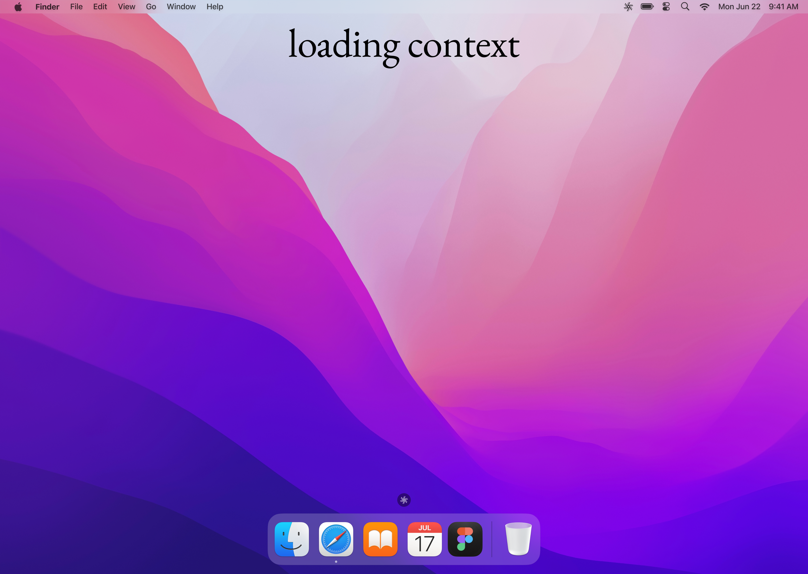
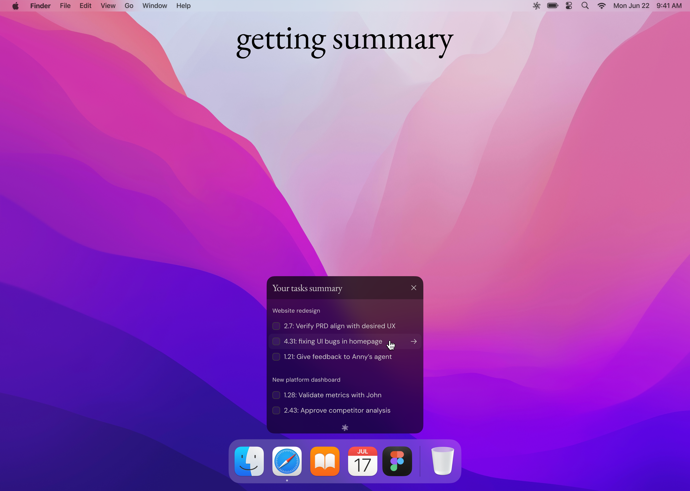
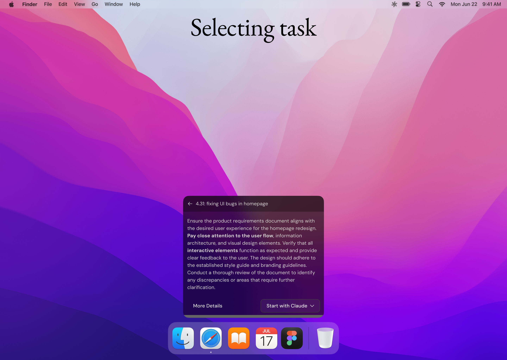
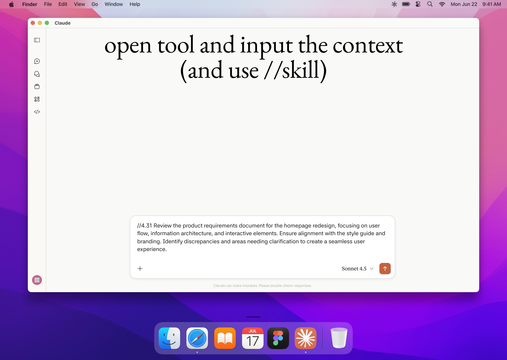
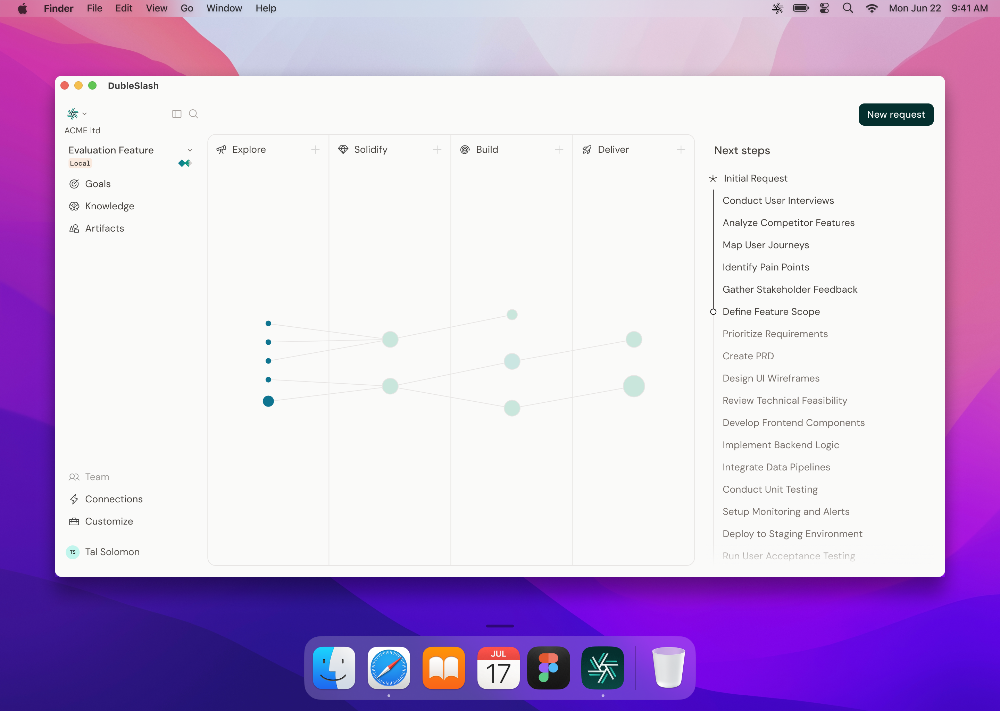
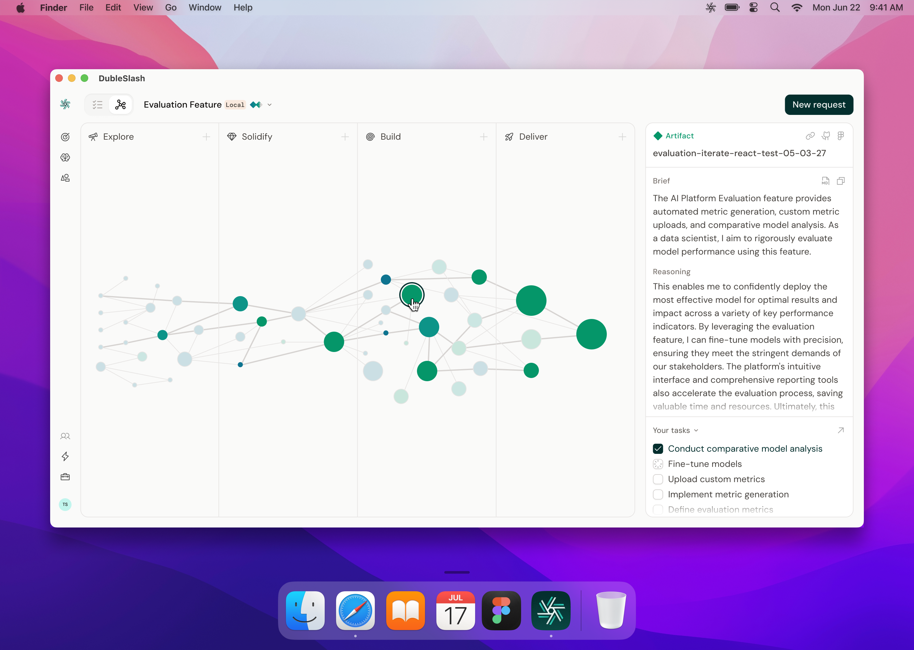
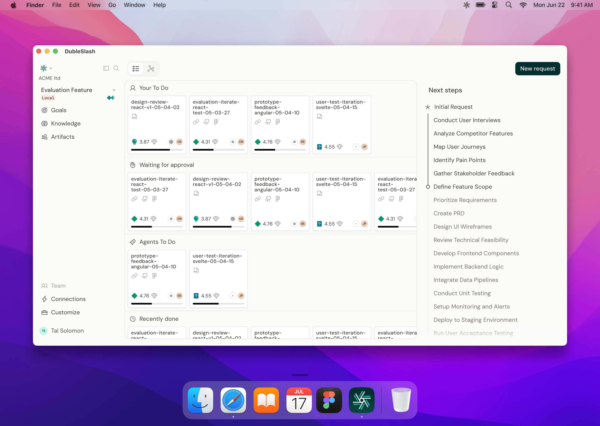

<!-- _class: forest -->

Duble//Slash · Seed deck · May 2026

<h1>// You know where you left off. <em>AI doesn't.</em></h1>

 

A <strong>desktop app</strong> that runs in your menu bar  -  capturing context across every session so when you press <strong>//</strong>, AI already knows the project, the phase, and where you stopped.

 

Context Cloud Session continuity Always-on Local-first

  

<strong style="color: #F4ECD7;">Tal Solomon</strong> &nbsp;·&nbsp; <strong style="color: #F4ECD7;">Shenhav Lev</strong> &nbsp;·&nbsp; co-founders

---

The shape of the problem

## Every AI session starts *cold*.

It doesn't matter which tool, which agent, or how long ago you stopped. Every new session is a blank slate.

<h3>Inside a session</h3>

AI is extraordinary. A brief in five minutes. A spec before lunch. A working prototype the same afternoon.

You're in flow. It knows the context. The work moves.

<h3>The moment you start again</h3>

New session. New agent. New day. **Blank slate.**

Re-explain the project. Re-paste the decisions. Re-brief the constraints. Reconstruct what you were trying to do.

 

Every boundary is a cold start: new session, new agent, a colleague picking up your work. The work doesn't carry. Only you do. And you're tired of carrying it.

---

The precise diagnosis

## This isn't a productivity problem. It's a *continuity* problem.

<blockquote>AI capability isn't the bottleneck. Every tool is powerful. The bottleneck is what happens between sessions.</blockquote>

 

The output is fast. The brief, the spec, the prototype: they have never been cheaper to produce.

But the <strong>thread</strong> (the project context, the decisions made, the direction locked) lives only in your head. Every time you hand it to AI, you reconstruct it by hand.

Nobody built the layer that carries the thread for you.

<h3>The pattern</h3>

<strong>New session:</strong> start from scratch, re-explain everything.

<strong>New agent:</strong> same project, same blank slate.

<strong>New day:</strong> pick up where you left off? Only if you remember where that was.

<strong>New colleague:</strong> hand off your context? You'd need to write it down first.

<h3>The cost</h3>

Every session, every handoff, every new colleague: each one costs the time to reconstruct what was already known. For a team, it compounds.

---

The one they haven't named

## The human layer has to be solved *first*.

"The connective layer that makes a company legible to AI by default. That's the real opportunity." We're building it. Starting where nobody has: with the non-technical worker who can't maintain AI context manually.

 

The integration nightmare (Slack, Linear, GitHub, Notion, custom glue code) exists because nobody solved the human layer first.

<strong>You can't build a company-level intelligence loop if every person inside that company is an open loop.</strong>

<h3>The non-technical majority</h3>

Designers, PMs, creative leads: the majority of knowledge workers. They understand what needs to be done. They cannot maintain AI context at the level required to make that happen.

<strong>The gap between their intent and AI's output is continuity. Nobody is closing that gap.</strong>

<h3>The project-level intelligence loop</h3>

Solve continuity at the individual level → handoffs stop breaking → the company builds a project-level intelligence loop, bottom-up, without engineering effort.

---

<!-- _class: forest -->

Introducing

# Duble//Slash.

A desktop app in your menu bar  -  always present, system-wide. Think Wispr Flow's form factor, applied to <em>context</em> instead of voice.

<h3>In the background</h3>

Quietly captures what you're working on across projects (decisions, briefs, design reviews, session outputs) and structures them in a personal **Context Cloud**.

You don't manage it. It runs.

<h3>When you press `//`</h3>

Wherever you are (any LLM, any agent, any tool) it injects the right context into the prompt automatically.

Project. Phase. What was decided. Where you left off. **AI picks up mid-thought.**

 

Tool-agnostic. Always on. Not a wrapper inside one tool  -  a context layer that lives across all of them.

---

<!-- _class: forest section-break -->

The user flow

---

<!-- _class: forest -->

The pill · in action

<h2>Session pickup.</h2>

Context retrieved before you type a word.

Project state, open decisions, last position: all loaded automatically. You open the tool and the work is already there.

---

<!-- _class: forest -->

The pill · in action

<h2>Task surface.</h2>

Open work surfaced by project and priority.

No digging. No thread archaeology. The right tasks appear in the right order, across every project you're running.

---

<!-- _class: forest -->

The pill · in action

<h2>Full context on demand.</h2>

Select a task. The brief is already there.

One tap to hand it to AI and move. The session starts where the last one ended. AI doesn't start from scratch anymore.

---

<!-- _class: forest -->

// in action

<h2>One trigger.</h2>

In any tool. Any agent. Without copy-pasting a single line of context.

Type <code>//</code> and the right context lands in the prompt automatically  -  project, phase, last decision, open threads. The session starts where the last one ended. AI doesn't start from scratch anymore.

---

<!-- _class: forest -->

The context cloud · building

<h2>Empty canvas.</h2>

First contact. The map begins to form.

Sparse at first. A direction, a few signals. Every session adds structure. The context cloud starts building from day one.

---

<!-- _class: forest -->

The context cloud · building

<h2>Living project map.</h2>

Every decision adds a node.

Briefs, reviews, handoffs, captured and connected automatically. The map grows without you managing it.

---

<!-- _class: forest -->

The context cloud · building

<h2>Team layer.</h2>

Human work and agent work, side by side.

Tasks route to the right person or agent. Everyone sees the same map. Nothing falls through the cracks.

---

The product · in motion

## You were mid-brief *yesterday*. Today you just continue.

01

Yesterday · any session

You're working on a brief in Claude. Deep in it: project locked, decisions made, direction clear.

You close the session. Life happens. You come back tomorrow.

›

02

In the background · always

Duble//Slash captured the session. What was decided. What was open. Where the work stood.

<strong>No action needed from you.</strong> It runs.

›

03

Today · new session

You open Claude. New session, blank by default.

You type <code>//</code>. The context is already in the prompt. Project, phase, last decisions, open threads.

<strong>You just continue.</strong>

 

No "where was I?" No re-briefing. No reconstructing. The session picks up mid-thought.

---

When it becomes a team

## Context doesn't break *between people*.

When a team adopts this, the cold-start problem stops being personal. It stops existing entirely.

01 · Individual

Personal context continuity

Every session picks up where it left off

<code>//</code>

→

02 · Team

Handoffs that don't break

No Slack thread. No re-briefing. Ever.

<code>//</code>

→

03 · Company

Artifacts AI reads natively

Built bottom-up. No integrations required.

The project-level intelligence loop, built from the human layer up, one <code>//</code> at a time.

---

// in the wild · tech teams

## The team moves like *one person who remembers everything*.

Six moments where having context changes how the work actually happens — not just how fast it goes.

<h3>Standup digest</h3>

One agent command surfaces what shipped, what's blocked, what needs a decision. <strong>Two minutes, not twenty.</strong>

<h3>PR handoff</h3>

Next dev types <code>//</code>. Context loads: the approach, what was tried, why this path. <strong>No three-message Slack reconstruction.</strong>

<h3>Design → dev review</h3>

The developer opens <code>//</code> and starts with everything the designer knew. <strong>Reviews start faster.</strong>

<h3>Sprint planning</h3>

Every open thread and unresolved decision surfaces before the call. <strong>The context cloud is the prep doc. No one had to write it.</strong>

<h3>Async handoff</h3>

West Coast closes the session. East Coast types <code>//</code> and picks up mid-thought. <strong>Timezone gaps stop being context gaps.</strong>

<h3>New hire onboarding</h3>

They type <code>//</code> and get the brief, the decisions made, the current phase. <strong>Full project context, day one.</strong>

---

The moat · methodology + agents

## *78 skills. 8 agents.* Built by design leaders, *for design leaders.*

Double Diamond, rebuilt for Human-AI collaboration. Four phases, four agent archetypes, 78 skill contracts. Every method specifies exactly how AI shows up.

<strong>Four archetypes.</strong> Nemo (Discover) · Tuna (Define) · Salmon (Develop) · Willy (Deliver). Each runs at the intensity that phase deserves. No PRD ceremony for a tooltip fix.

<strong>Four HAI collaboration modes.</strong> Solo · Co-pilot · Prepare-and-synthesize · Stay out. The method specifies which. The agent is bound to the contract, not the vibe.

No one else trained agents on a practitioner design methodology. They have chatbots with a design theme. We have a methodology agents can actually run.

Tier 0 · Orchestration

Apex
Guard
routes · protects

Tier 1 · Context workers

Echo
Prism
capture · distill

Tier 2 · Phase operators · invoked via <code style="font-size:0.82em; background:var(--cream-soft); border:1px solid var(--cream-edge); padding:0 4px; border-radius:3px;">//</code>

Dora

Explorer · Discover

Sol

Solidifier · Define

Bran

Builder · Develop

May

Shipper · Deliver

Published 2024 · <strong style="color:var(--ink);">talsolomonux.com</strong>

---

Why now

## Three windows that *don't stay open*.

<h3>1 · The paradox is public</h3>

DORA, METR, Faros, GitClear. 2024–2025 was the year the data landed. Teams know output is up and shipped value isn't. **First mover on naming the missing layer wins.**

<h3>2 · The vacuum</h3>

Every player builds for technical users, inside a single tool. No one has built the **over-layer**: tool-agnostic, working across any LLM, any agent, any workflow, for the non-technical majority. **That slot is still empty.**

<h3>3 · The substrate landed</h3>

`AGENTS.md` and `CLAUDE.md` auto-loading across Copilot, Cursor, Claude Code is the right substrate for `//`-injection. **Twelve months ago this took three pastes.**

 

The category window is 4–5 months. After that, the context layer either has us, has BMAD, or gets absorbed into a tool.

---

The adoption gap · why it exists

## They tried AI for design work. *68% opted out.*

68%

of designers <strong>don't trust or use AI for core design work</strong>  -  even at companies that have fully adopted it. NNG 2025

2×

Developers adopt AI at <strong>twice the rate of designers</strong>  -  59% vs 31% for core tasks. The non-technical gap isn't closing. Worklytics 2025

40%

of productive time consumed by <strong>context switching</strong>. 1,200 app-switches daily. 23 minutes to regain focus after each one. APA / SpeakWise 2025

<h3>Why AI fails designers</h3>
You can't prompt-engineer a visual brief. Brand, flow, constraints, decisions - none of it lives in the AI session. Every prompt starts cold. <strong>The context layer is exactly what's missing.</strong>

<h3>Beachhead</h3>
13 Israeli design studios (KIDO, Firma, Hello Design, Nmore + 9 more) · 8-week pilot · TLV + Herzliya cluster. Land via methodology; expand via continuity layer.

<h3>Wedge → Adjacent</h3>
Designers pull dev + PM along. Solve continuity for one discipline and the whole team adopts. The context layer grows with the org.

---

Pricing

## Always free for individuals. *Continuity* sold as a team capability.

<h3>Free</h3>

$0

Full agent suite. Methodology spec. Session capture. Desktop app. Trust receipts. Forever free for individuals.

 

<code>npx @dubleslash/install</code>

<h3>Team</h3>

$19 / seat / mo

Multiplayer context. Team handoffs. Daily digest. Per-team context policy. Onboarding. Analytics.

3-seat minimum.

<h3>Enterprise</h3>

Custom

Org-level context policy. SSO. Audit logs. Dedicated onboarding. Anthropic partnership pilots.

 

Contact us.

The continuity layer is worth multiple seats of Notion or Linear-equivalent. We undercut intentionally during the methodology-as-distribution phase.

---

Roadmap

## // Agents Launch → V1 → V1.5 → V2.

<svg width="17" height="13" viewBox="0 0 17 13" fill="none"><path d="M1.5 6.5L6 11L15.5 1.5" stroke="#F4ECD7" stroke-width="2.4" stroke-linecap="round" stroke-linejoin="round"/></svg>

now M1

// Agents Launch

May 2026

8 agents · 3 tiers npx install · macOS session capture

2

M2

V1 · Context Cloud

Sep 2026

// injection · desktop app context onboarding team handoffs

3

M3

V1.5 · Multiplayer

Jan 2027

paid tier launch daily digest per-team context policy

4

M4

V2 · Enterprise

H1 2027

process telemetry enforcement Figma / GitHub bridges

<strong>Critical path ·</strong> // Agents → free distribution · V1 → paid revenue · V1.5 → team pricing · V2 → enterprise

---

Where we are · today

## What's already on the table.

78

named <strong>operator skills</strong> shipped. Heuristic scan, journey map, premortem, contract readout, slice plan, trust receipt  -  all sourced.

8

named <strong>agents</strong> across 3 layers  -  Tier 0 (Apex · Guard), Tier 1 (Echo · Prism), Tier 2 (Dora · Sol · Bran · May). Full stack.

39

<strong>Israeli design leaders</strong> in commit conversations. TLV / Herzliya cluster days lined up for launch.

 

65

commits pre-fundraise. Two founders, public repo, all shipped in the open.

28

methodology pages  -  Fish spec, anatomy, transitions, contracts, HAI-collaboration, ai-modes.

24K

lines of methodology spec + agent definitions in <code>github.com/talsolomon/DubleSlash</code>.

All shipped pre-fundraise. The substrate is in place  -  what we need is the runtime team to ship V1.

---

Team

## We've lived this. *Twice*.

Two founders. Complementary craft. Same thesis. <strong style="color: var(--ink);">Already shipping in public.</strong>

<h3 style="color: var(--forest); font-size: 0.9rem;">Tal Solomon · co-founder · CEO</h3>

Product & design executive. Lived two platform shifts end to end: SaaS through 2018, AI through 2026.

Shipped product across the full stack of design, PM, and engineering. Deep in the practitioner network the OSS launch will spread through.

<h3 style="color: var(--forest); font-size: 0.9rem;">Shenhav Lev · co-founder · CPDO</h3>

Senior product designer. Studio-grown, freelance-tested. The reason this is designer-led, not engineer-led.

Drove the visual + interaction system that makes Duble//Slash legible to a designer-first audience  -  the exact wedge that pulls dev + PM along.

---

The ask

## *$2.5M* seed · 18 months · ships V1 + opens Series A.

$2.5M

$900k

Engineering

2 engineers · 80k ₪/mo employer cost each · 18 months

$1.3M

GTM + Marketing

Launch · content · events · design community programs

$300k

Infra

Cloud · CDN · security audit

Every dollar in this round ships product or buys distribution. Zero hand-wave.

<h3>Milestones the round buys</h3>

<strong>M1 · // Agents Launch</strong> · May 2026 8 agents · 3 tiers · session capture · npx install

<strong>M2 · V1 runtime</strong> · Sep 2026 <code>//</code> injection + Context Cloud + first 10 design partners

<strong>M3 · V1.5 multiplayer</strong> · Jan 2027 Paid tier launch · 1k seats targeted

<strong>M4 · Series A trigger</strong> · H1 2027 $300k+ ARR · Anthropic relationship · enterprise pilots

---

<!-- _class: forest -->

The bet · the vision

# By 2028, this is *how teams run* AI-assisted work.

 

<blockquote style="font-size: 1.6rem; line-height: 1.3;">The context layer is the most valuable real estate of the next decade.</blockquote>

The methodology is the public good. The continuity layer is what we sell.

 

When a team's context doesn't break, the company itself becomes legible to AI  -  naturally, bottom-up, without any engineering effort. Same shape as React → Vercel. The category creates the platform.

<h3 style="color: #B8C9BD;">Tal Solomon · co-founder</h3>

talsolomon21@gmail.com

